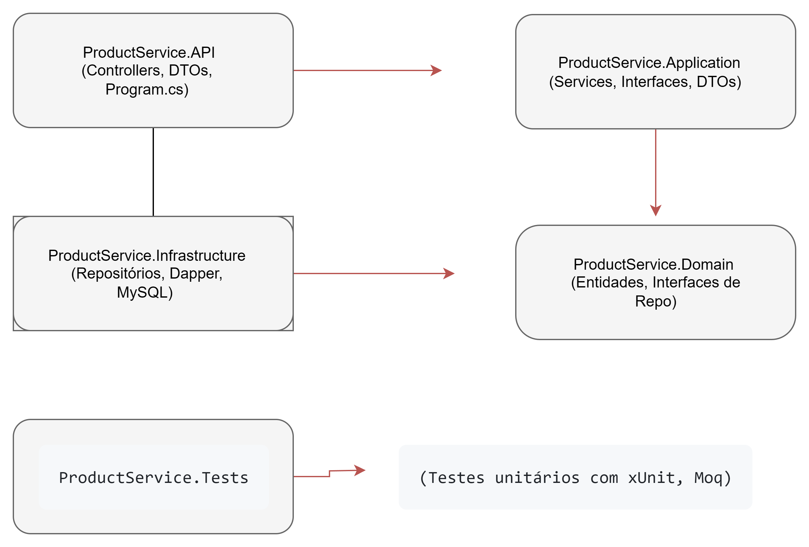

# 🛒 Projeto de Cadastro de Produtos

Sistema completo de cadastro de produtos com **.NET 8 (API REST)** no backend e **Angular** no frontend.


##  Tecnologias

- .NET 8 (API REST)
- Angular 16+ (Standalone components)
- MySQL
- Clean Architecture
- JWT Authentication

---

##  Arquitetura do Projeto

### 1. Visão Geral (Arquitetura de Alto Nível)

O sistema está dividido em três camadas principais:

- **Frontend Angular**: Interface do usuário.
- **Backend .NET API**: Lógica de negócios e autenticação.
- **Banco de Dados MySQL**: Armazenamento relacional com queries SQL via Dapper.

---

### 2. Estrutura do Backend (.NET API)

A API segue os princípios da **Clean Architecture**, com separação de responsabilidades por projeto.





####  Detalhes das Camadas

- **`ProductService.Domain`**: Contém as entidades de negócio e contratos (interfaces). Não depende de outras camadas.
- **`ProductService.Application`**: Orquestra os fluxos de negócio. Contém serviços e casos de uso.
- **`ProductService.Infrastructure`**: Implementa os contratos do domínio usando Dapper para MySQL.
- **`ProductService.API`**: Expõe os endpoints via Controllers.
- **`ProductService.Tests`**: Projeto de testes unitários (xUnit, Moq, FluentAssertions).

---

### 3. Estrutura do Frontend (Angular)

A interface Angular usa uma **arquitetura modular baseada em componentes**.

```
/src/app/
  ├── core/
  │   ├── guards/          (Proteção de rotas - auth.guard.ts)
  │   ├── interceptors/    (JWT Interceptor - token.interceptor.ts)
  │   └── services/        (Serviços de autenticação, etc.)
  │
  ├── features/
  │   ├── login/           (Tela de login)
  │   └── products/        (CRUD de produtos)
  │       ├── components/  (Formulário e lista de produtos)
  │       ├── pages/       (Dashboard de produtos)
  │       └── services/    (product.service.ts, department.service.ts)
  │
  ├── shared/
  │   ├── components/      (layout geral)
  │   └── models/          (Interfaces TypeScript como Product, User, etc.)
  │
  ├── app.config.ts        (Configuração principal)
  └── app.routes.ts        (Rotas da aplicação)
```

####  Resumo das Pastas

- **`core/`**: Serviços e regras compartilhadas, instanciados globalmente.
- **`features/`**: Módulos funcionais, cada um com seus próprios componentes.
- **`shared/`**: Componentes e modelos reutilizáveis em múltiplos lugares.

##  Pré-requisitos

- .NET SDK 8+
- Node.js 18+
- Angular CLI
- MySQL
- Git
- Editor de código: VS Code ou Visual Studio

---

##  Configuração

##  Como baixar e iniciar o projeto

Antes de começar a configurar e rodar o projeto localmente, é necessário fazer o download dos arquivos do repositório. Para isso, siga os passos abaixo:

###  1. Clone o repositório do GitHub

Abra o terminal ou prompt de comando e execute:

```bash
# Clona o projeto do GitHub para sua máquina
git clone https://github.com/Grace-Garces/MaximaTeste.git

# Acesse a pasta do projeto clonado 
cd MaximaTeste
(atalho para abrir o projeto VS code pelo cmd ou git bash: "code .")

### 1. Banco de Dados (MySQL)

Execute o script SQL incluído no projeto (`script.sql`) no MySQL. O mesmo irá não só criar o banco, mas também as tabelas necessárias.

---

### 2. Backend (.NET API)

#### Visual Studio

1. Abra `TesteMaxima.sln`.
2. Configure `appsettings.Development.json`:
   ```json
   "DefaultConnection": "Server=localhost;Database=testemaxima;User=seuUser;Password=senha;",
   ```
3. Execute o projeto com F5. Swagger abrirá automaticamente.

#### Visual Studio Code

```bash
dotnet restore
cd ProductService.API
dotnet run
```

---

### 3. Frontend (Angular)

1. Abra a pasta `WebApp`.
2. Execute:

```bash
npm install
ng serve -o
```

3. Certifique-se que o `apiUrl` nos arquivos de serviço está correto com a porta da API em:
``` Arquivos:
auth.ts
department.ts
product.ts
```
---

##  Primeiro Acesso

1. Vá até `/swagger` e registre um usuário com `POST /api/auth/register`.
2. Use o login para acessar o frontend (`http://localhost:4200`).

---

##  Funcionalidades

- Autenticação com JWT
- CRUD de Produtos
- Filtro por código/descrição
- Cadastro e visualização por departamento

---

##  Testes

```bash
dotnet test
```

---


Feito por **Grace Kathelyn Garcês Batista** 
